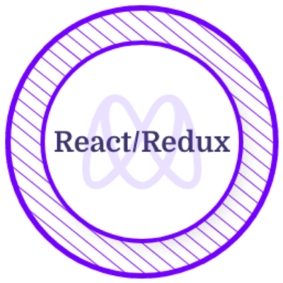

<h1>Hello there👌</h1>

  I'm Leslie, a full-stack developer with a passion for creating beautiful, user-friendly applications. When I'm not coding, you can find me hiking in the mountains or experimenting with whatever music intsrument I lay my hands on.

 

  

<em>Remote Full-Stack developer ready for adventure</em>

 

## Education

### FULL STACK WEB DEVELOPMENT

**Microvese** • 2022 - 2023

- Completed coursework in algorithms, data structures, and web development
- Participated in several coding competitions and hackathons
- Mentored new students at Microverse

<h2>My stats📊</h2>

| | |
| :---: | :---: |
|  |  | 
|  |  |
 

<h2>Tech & Tools Preference🛠</h2>

  

<h2>Licence & Certicifications👩‍🎓</h2>

 ## 📫Reach me at: 

